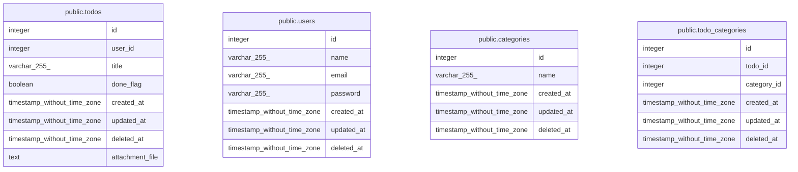

# next_go

## テーブル一覧

| 名前 | カラム一覧 | コメント | タイプ |
| ---- | ------- | ------- | ---- |
| [public.todos](public.todos.md) | 8 | Todosテーブル | BASE TABLE |
| [public.users](public.users.md) | 7 | ユーザーテーブル | BASE TABLE |
| [public.categories](public.categories.md) | 5 | カテゴリテーブル | BASE TABLE |
| [public.todo_categories](public.todo_categories.md) | 6 | Todo, カテゴリ中間テーブル | BASE TABLE |

## ER図

---

> Generated by [tbls](https://github.com/k1LoW/tbls)
