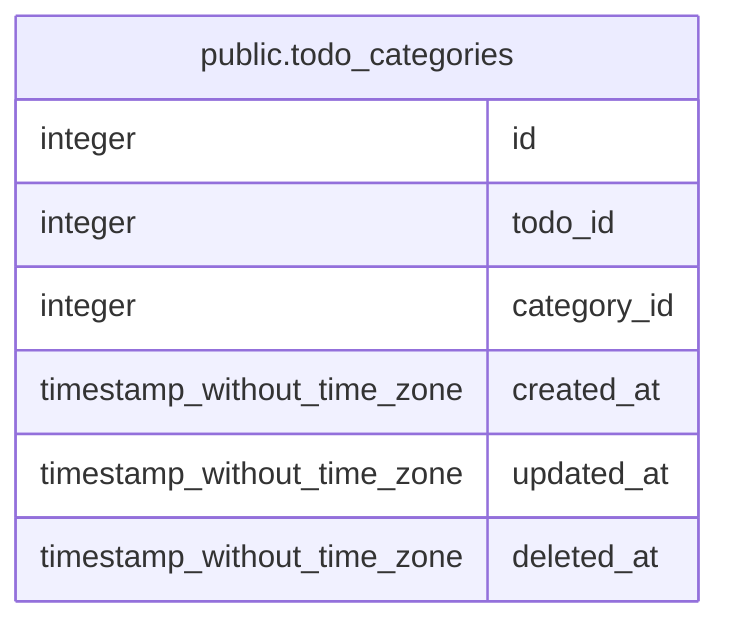

# public.todo_categories

## 概要

Todo, カテゴリ中間テーブル

## カラム一覧

| 名前 | タイプ | デフォルト値 | Nullable | 子テーブル | 親テーブル | コメント |
| ---- | ------ | ------------ | -------- | ---------- | ---------- | -------- |
| id | integer | nextval('todo_categories_id_seq'::regclass) | false |  |  | ID |
| todo_id | integer |  | false |  |  | TodoID |
| category_id | integer |  | false |  |  | カテゴリID |
| created_at | timestamp without time zone | CURRENT_TIMESTAMP | false |  |  | 登録日時 |
| updated_at | timestamp without time zone | CURRENT_TIMESTAMP | false |  |  | 削除日時 |
| deleted_at | timestamp without time zone |  | true |  |  |  |

## 制約一覧

| 名前 | タイプ | 定義 |
| ---- | ---- | ---------- |
| todo_categories_pkey | PRIMARY KEY | PRIMARY KEY (id) |

## INDEX一覧

| 名前 | 定義 |
| ---- | ---------- |
| todo_categories_pkey | CREATE UNIQUE INDEX todo_categories_pkey ON public.todo_categories USING btree (id) |

## ER図

---

> Generated by [tbls](https://github.com/k1LoW/tbls)
